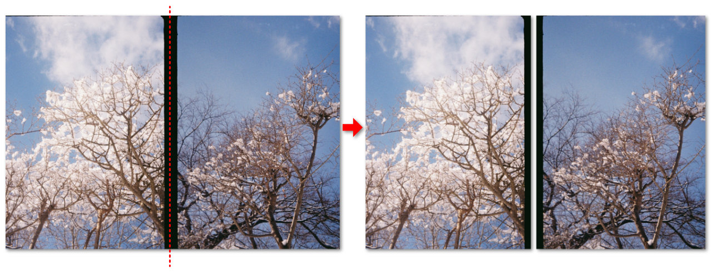

# HalfFrame Separator

## 概要

1つのフレームに2つの写真が収まったハーフ判の写真を個別の画像に分割するPythonツールです。  
あなたのOLYMPUS PENやPENTAX 17や他の楽しいハーフ判カメラたちともっと仲良くなれることを期待しています。



## 依存ライブラリ

- PIL (pillow)
- NumPy
- SciPy

## 使い方

```bash
python halfframe.py <入力ディレクトリ>
    [--outdir 出力ディレクトリ] \
    [--threshold 値] \
    [--dilation 値] \
    [--erosion 値] \
    [--crop 値] \
    [--no-keep-exif] \
    [--num-processes 値]
```

境界の認識に失敗した場合は、つながったままの画像で出てきます。

### 引数

- `indir`: ソース画像ディレクトリ（必須）
- `--outdir, -o`: 出力画像ディレクトリ（オプション、デフォルト: `{indir}_separated`）
- `--threshold, -t`: フレーム間隔を検出するための暗さの閾値（デフォルト: 64）
- `--dilation, -d`: スムージング用の膨張反復回数（デフォルト: 7）
- `--erosion, -e`: スムージング用の収縮反復回数（デフォルト: 14）
- `--crop`: 指定時は、検出されたフレーム間領域をこのピクセル数はみ出すようにクロップし、
    出力に黒い帯が残らないようにします
- `--no-keep-exif`: EXIF情報を保存しません
- `--num-processes`, `-j`: 並列処理を行います
    * 単に `-j` とだけ指定した場合: CPUコア数と同じ数のサブプロセスを起動します
    * `-j 4` のように明示的にプロセス数を指定できます
    * このオプションをつけない場合は1スレッドで逐次処理されます

### 対応フォーマット

JPEG, TIFF

### 現状の制約

- 一度画像をデコードし、処理を行った後再エンコードするので、画質劣化があるかも……。

### 行っている処理について

画像横幅の中央から±10%の位置にある黒い縦帯を見つけ、その中央で画像を分割します。
このために、単に指定の閾値以下のピクセル明るさを検出し、フレームの中央にあると仮定される境界を認識しています。
このとき、ノイズの影響や部分的な欠損があってもできるだけ正確に中心位置を検出できるよう、モルフォロジー（膨張・収縮）という古典的な画像処理手法を使って判定マスクをスムーシングします。


## 生成AIの使用について

コーディング・ドキュメント執筆に部分的にGitHub Copilotを活用しています。

---

# HalfFrame Separator

## Overview

This is a Python tool that splits half-frame photos, which contain two pictures in one frame, into individual images.  
We hope you can enjoy your OLYMPUS PEN, PENTAX 17, and other fun half-frame cameras even more.


## Dependencies

- PIL (pillow)
- NumPy
- SciPy

## Usage

```bash
python halfframe.py <input_directory> \
    [--outdir output_directory] \
    [--threshold value] \
    [--dilation value] \
    [--erosion value] \
    [--crop value] \
    [--no-keep-exif] \
    [--num-processes value]
```

If boundary recognition fails, the images may come out connected.

### Arguments

- `indir`: Source image directory (required)
- `--outdir, -o`: Output image directory (optional, default: `{indir}_separated`)
- `--threshold, -t`: Darkness threshold for detecting frame intervals (default: 64)
- `--dilation, -d`: Number of dilation iterations for smoothing (default: 7)
- `--erosion, -e`: Number of erosion iterations for smoothing (default: 14)
- `--crop`: When specified, crops the detected frame boundary area by this many pixels
    to prevent black bands from remaining in the output
- `--no-keep-exif`: Does not keep the EXIF information in the saved files
- `--num-processes`, `-j`: Enables parallel processing
    * When only `-j` is specified: Launches a number of subprocesses equal to the number of CPU cores
    * You can explicitly specify the number of processes like `-j 4`
    * Without this option, processing is done sequentially in a single thread

### Supported Formats

JPEG, TIFF

### Current Limitations

- There may be a loss of quality since images are decoded, processed, and then re-encoded.

### About the Processing

The tool detects a black vertical band located at ±10% from the center of the image width and splits the image at its center.
To do this, it simply detects pixel brightness below the specified threshold and recognizes the boundary assumed to be at the center of the frame.
During this process, it uses morphological operations (dilation and erosion), a classical image processing technique, to smooth the detection mask so that the center position can be detected as accurately as possible, even in the presence of noise and partial defects.

## Declaration of Use of Generative AI

We partially utilize GitHub Copilot for coding and document writing.

